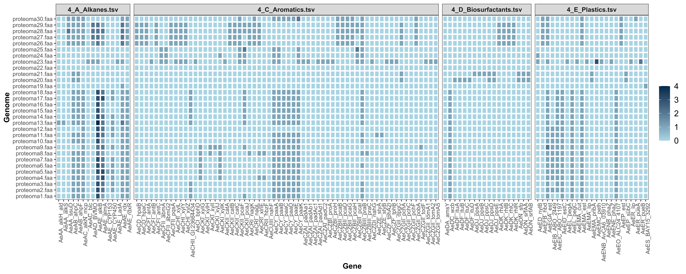
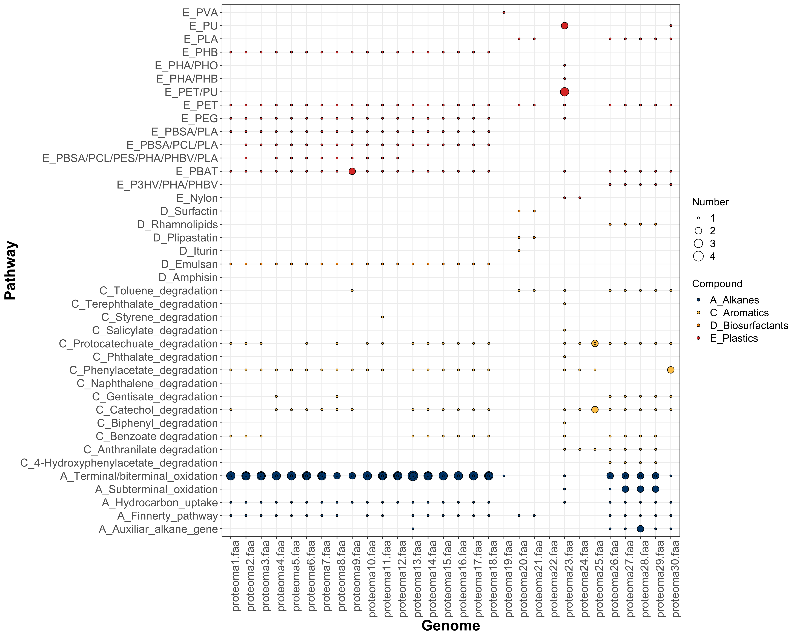

 

# HADEG: A Curated Hydrocarbon Aerobic Degradation Enzymes and Genes Database

Jorge Rojas-Vargas<sup>1</sup>, Hugo G. Castelán-Sánchez<sup>2</sup>, Liliana Pardo-López<sup>1</sup>

<sup>1</sup>Departamento de Microbiología Molecular, Instituto de Biotecnología, UNAM, Av. Universidad #2001, Col. Chamilpa, 62210 Cuernavaca, Morelos, México

<sup>2</sup>Programa de Investigadoras e Investigadores por México. Grupo de Genómica y Dinámica Evolutiva de Microorganismos Emergentes. Consejo Nacional de Ciencia y Tecnología. Av. Insurgentes Sur 1582, Crédito Constructor, Benito Juárez, CP 03940, Ciudad de México, México.

## Description

The Hydrocarbon Aerobic Degradation Enzymes and Genes (HADEG) is a manually curated database containing sequences of experimentally validated proteins and genes to be used for annotation purposes. The first version described in the published article (*DOI 10.1016/j.compbiolchem.2023.107966*) had 259 proteins for hydrocarbon (HC) degradation, 160 for plastic degradation, and 32 for biosurfactant production (September, 2023). The updated database has 402 for HC degradation, 191 for plastic degradation, and 36 for biosurfactant production (November, 2023). The database is updated regularly.

## Recommended immplementation


### A. Extracting the HADEG tables

1- Install Proteinortho software in your computer or server (https://anaconda.org/bioconda/proteinortho).

2- Annotate your genome(s) using your preferred annotation software and save the resulting .faa file(s) in a designated directory.

3- Download the "HADEG_protein_database_231119.faa" and place it in the same directory.

4- Execute Proteinortho, comparing your .faa file(s) with the HADEG database: 
```sh
proteinortho Directory_with_proteomes/*.faa -identity=50 -conn=0.3 -project=Results_HADEG
```
5- Download the **Script** directory and put your there Results_HADEG.tsv file obtained with Proteinortho. **NOTE**: do not change the ".faa" part of the proteomes names in your .tsv Proteinortho file.

6- Run the *1_extract_HADEG_tables* script in your terminal or RStudio:
```sh
Rscript 1_extract_HADEG_tables.R
```
This script will generate the following output tables:

*GENERAL TABLES*

1_table_HADEG_codes.tsv : tabla con los códigos de las proteínas de tus .faa files ortólogas a las secuencias de proteínas de HADEG database.

2_table_HADEG_counts.tsv : tabla con el número de proteínas de tus .faa files ortólogas a las secuencias de HADEG.

3_table_HADEG_final.tsv : tabla with the summarized counts of each type of HADEG proteins, including the Mechanism, Compounds, Pathways, Subpathways, and Gene names.


*SPECIFIC TABLES*

Differente versions of the "3_table_HADEG_final.tsv", depending on the "Compounds" found in your genomes: 4_A_Alkanes.tsv, 4_B_Alkenes.tsv, 4_C_Aromatics.tsv, 4_D_Biosurfactants.tsv, and 4_E_Plastics.tsv


### B. Generating the HADEG plots

7- Run *2_generate_HADEG_plots* script in the same directory to generate SVG files of HADEG heatmap and bubble plots:
```sh
Rscript 2_generate_HADEG_plots.R
```
8- Change the colors, the plot and font sizes if you need it. Now enjoy your results.

## Example

You can download a trial TSV file from the *Example* directory and run the scripts described above. Besides the output tables, you will obtain plots like these with the number of hits predicted in each genome:

**HEATMAP**

 

**BUBBLE PLOT**

 

## Description of this GitHub repository

### 1. Seq_amino_acids

Contains the amino acid sequences divided in hydrocarbon groups and biosurfactant production:

- Alkanes
- Alkenes
- Aromatics
- Biosurfactants
- Plastics

### 2. Seq_nucleotides

Contains the nucleotides sequences divided in hydrocarbon groups and biosurfactant production:

- Alkanes
- Alkenes
- Aromatics
- Biosurfactants
- Plastics

### 3. Tables

Contains tables with degradation pathways, biodegradation production, and protein domains:

- 1_Aerobic_alkane_degradation_pathways_and_genes
- 2_Aerobic_alkene_degradation_pathways_and_genes
- 3_Aerobic_aromatic_degradation_pathways_and_genes
- 4_Plastic_degradation_pathways_and_genes
- 5_Biosurfactant_production_genes
- 6_Protein_domains_of_HADEG_proteins
- 7_All_pathways


## Citation

Rojas-Vargas, J, Castelán-Sánchez, HG, Pardo-López, L (2023) HADEG: A curated hydrocarbon aerobic degradation enzymes and genes database. Computational Biology and Chemistry. DOI 10.1016/j.compbiolchem.2023.107966

https://www.sciencedirect.com/science/article/abs/pii/S1476927123001573?via%3Dihub
