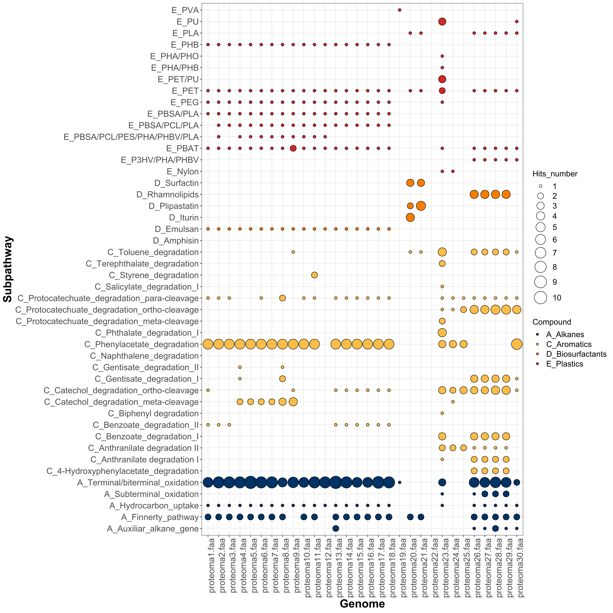
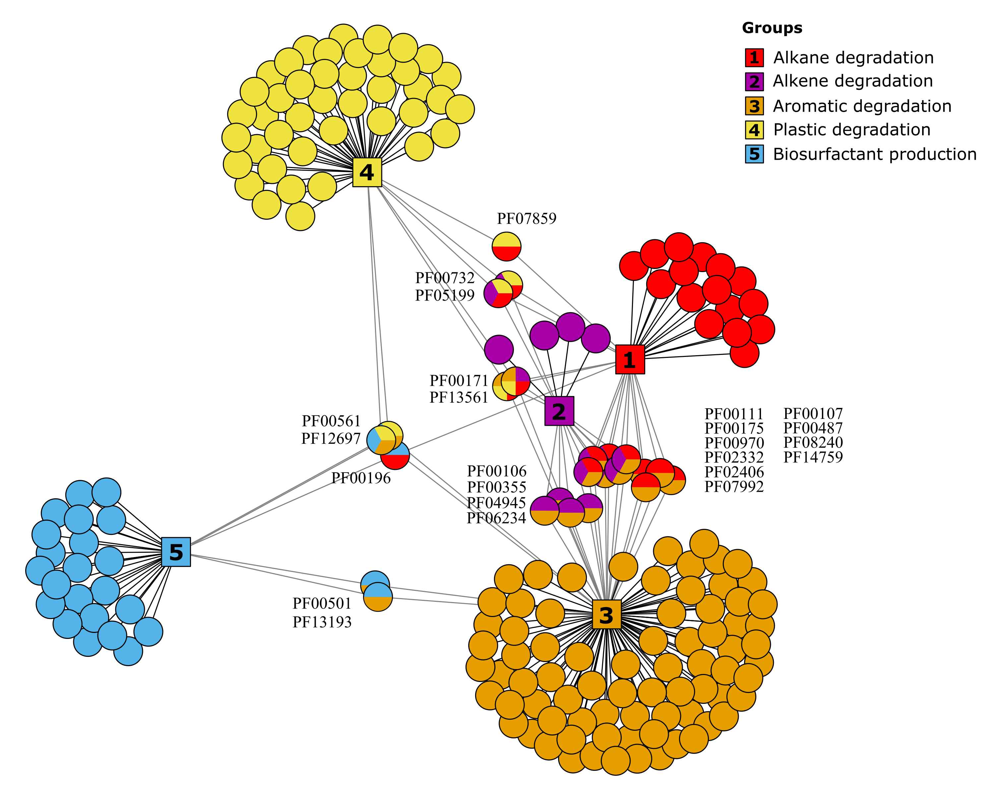

 

# HADEG: A Curated Hydrocarbon Aerobic Degradation Enzymes and Genes Database

Jorge Rojas-Vargas<sup>1</sup>, Hugo G. Castelán-Sánchez<sup>2</sup>, Liliana Pardo-López<sup>1</sup>

<sup>1</sup>Departamento de Microbiología Molecular, Instituto de Biotecnología, UNAM, Av. Universidad #2001, Col. Chamilpa, 62210 Cuernavaca, Morelos, México

<sup>2</sup>Programa de Investigadoras e Investigadores por México. Grupo de Genómica y Dinámica Evolutiva de Microorganismos Emergentes. Consejo Nacional de Ciencia y Tecnología. Av. Insurgentes Sur 1582, Crédito Constructor, Benito Juárez, CP 03940, Ciudad de México, México.

- [Description](#Description)
- [Recommended immplementation](#Recommended-immplementation)
- [Example](#Example)
- [Description of this GitHub repository](#Description-of-this-GitHub-repository)
- [Pfams network](#Pfams-network)


## Description

The Hydrocarbon Aerobic Degradation Enzymes and Genes (**HADEG**) is a manually curated database containing sequences of experimentally validated proteins and genes to be used for annotation purposes. 

The first version described in the published article ([link](https://www.sciencedirect.com/science/article/abs/pii/S1476927123001573?via%3Dihub)) had 259 proteins for hydrocarbon (HC) degradation, 160 for plastic degradation, and 32 for biosurfactant production (September, 2023). The updated database has 402 for HC degradation, 191 for plastic degradation, and 36 for biosurfactant production (November, 2023). 

:warning: **HADEG database is updated regularly** :warning:

## Recommended immplementation

1- Install [Proteinortho](https://anaconda.org/bioconda/proteinortho) software in your computer or server.

2- Annotate your genome(s) or assembled metagenome(s) using your preferred annotation software and save the resulting .faa file(s) in a designated directory.

3- Download the "HADEG_protein_database_231119.faa" and place it in the directory of your .faa file(s).

4- Execute Proteinortho, comparing your .faa file(s) with the HADEG database: 
```sh
proteinortho Directory_with_proteomes/*.faa -identity=50 -conn=0.3 -project=Results_HADEG
```
> [!NOTE]
> Using these parameters (-identity=50 and -conn=0.3) you could get 20.80% of false-negative hits and 94.68% of true-positive hits as described in the [HADEG](https://www.sciencedirect.com/science/article/abs/pii/S1476927123001573?via%3Dihub) published article.

5- Download the **Script** directory and put there your Results_HADEG.proteinortho.tsv file obtained with Proteinortho. 
> [!IMPORTANT]
> Do not change the ".faa" part of the proteomes names in your .tsv Proteinortho file.

6- Run the *HADEG* script in your terminal or [RStudio](https://posit.co/download/rstudio-desktop/#download):
```sh
Rscript HADEG.R
```
This script will generate the following `outputs`:

> *GENERAL TABLES*

**- 1_table_HADEG_codes.tsv**: Table with the protein codes from your .faa files that are orthologous to the protein sequences in the HADEG database. This table will allow you to search for protein sequences in your .faa files for more advanced analyses.

**- 2_table_HADEG_counts.tsv**: Table with the number of proteins from your .faa files that are orthologous to the sequences in HADEG. You can review in detail the number of hits against the HADEG sequences.

**- 3_table_HADEG_final.tsv**: Table with the summarized counts of each type of HADEG genes, including the Mechanism, Compounds, Pathways, Subpathways, and Gene names.


> *SPECIFIC TABLES*

Differente versions of the **3_table_HADEG_final.tsv**, depending on the "Compounds" found in your genomes/metagenomes: 4_A_Alkanes.tsv, 4_B_Alkenes.tsv, 4_C_Aromatics.tsv, 4_D_Biosurfactants.tsv, and/or 4_E_Plastics.tsv. These tables will be used to obtain the HADEG plots.

> *HADEG PLOTS*

**- Heatmap_Genes_HADEG.svg**: heatmap with the genes and the number of hits identified in your .faa files.

**- Bubbles_Subpathways_HADEG.svg**: bubble plot with the subpathways and the number of hits identified in your .faa files.

7- Change the colors, the plot and font sizes, or the script if you need it. Now enjoy your results.

## Example

You can download a trial TSV file from the *Example* directory and run the HADEG R script described above. Besides the output tables, you will obtain plots like these with the number of hits predicted in each genome:

**HEATMAP**

 

**BUBBLE PLOT**

 

## Description of this GitHub repository

### 1. Seq_amino_acids

Contains the amino acid sequences divided in hydrocarbon groups and biosurfactant production:

- Alkanes
- Alkenes
- Aromatics
- Biosurfactants
- Plastics

### 2. Seq_nucleotides

Contains the nucleotides sequences divided in hydrocarbon groups and biosurfactant production:

- Alkanes
- Alkenes
- Aromatics
- Biosurfactants
- Plastics

### 3. Tables

Contains tables with degradation pathways, biodegradation production, and protein domains:

- 1_Aerobic_alkane_degradation_pathways_and_genes
- 2_Aerobic_alkene_degradation_pathways_and_genes
- 3_Aerobic_aromatic_degradation_pathways_and_genes
- 4_Plastic_degradation_pathways_and_genes
- 5_Biosurfactant_production_genes
- 6_Protein_domains_of_HADEG_proteins
- 7_All_pathways
- 8_Matrix_pfams_only

## Pfams network

In this new version of HADEG, the number of Pfam domains increased from 166 to 184 (link to the table). The updated network analysis reveals that the Aromatic degradation protein group now contains 96 Pfams, the Plastic group 49, the Alkane group 32, the Alkene group 18, and the Biosurfactant production group 27.

 
**HADEG Pfams network** The circles represent the Pfams: for alkane degradation in red, for alkene degradation in magenta, for aromatics degradation in
orange, for plastic degradation in yellow, and for biosurfactant production in blue. The shared protein domains among groups are shown with multicolor circles.

## Citation

Rojas-Vargas, J, Castelán-Sánchez, HG, Pardo-López, L (2023) HADEG: A curated hydrocarbon aerobic degradation enzymes and genes database. Computational Biology and Chemistry. DOI 10.1016/j.compbiolchem.2023.107966
[ScienceDirect](https://www.sciencedirect.com/science/article/abs/pii/S1476927123001573?via%3Dihub)
